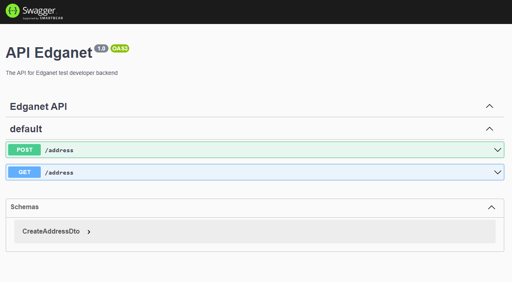

## Tech Stack

**Server:** Nest.js, PostgreSQL, Typeorm, Docker, Jest.js,

## Installation

Clone the project

```bash
  git clone https://github.com/viniciusnascimento95/challenge-egadnet-backend.git

  cd challenge-egadnet-backend
```

Install dependencies NPM

```bash
  npm install
```

## Docker

Start database PostgreSQL

```bash
  docker-compose up
```

Run migrations api backend

```bash
  npm run typeorm migration:run
```

Start backend

```bash
  npm run start:dev
```

## Running Tests

To run tests, run the following command

```bash
  npm run test
```

## API docs run in http://localhost:3333/api




<p align="center">
  <a href="http://nestjs.com/" target="blank"></a>
</p>

[circleci-image]: https://img.shields.io/circleci/build/github/nestjs/nest/master?token=abc123def456
[circleci-url]: https://circleci.com/gh/nestjs/nest

  <p align="center">A progressive <a href="http://nodejs.org" target="_blank">Node.js</a> framework for building efficient and scalable server-side applications.</p>
    <p align="center">
<a href="https://www.npmjs.com/~nestjscore" target="_blank"></a>
<a href="https://www.npmjs.com/~nestjscore" target="_blank"></a>
<a href="https://www.npmjs.com/~nestjscore" target="_blank"></a>
<a href="https://circleci.com/gh/nestjs/nest" target="_blank"></a>
<a href="https://coveralls.io/github/nestjs/nest?branch=master" target="_blank"></a>
<a href="https://discord.gg/G7Qnnhy" target="_blank"></a>
<a href="https://opencollective.com/nest#backer" target="_blank"></a>
<a href="https://opencollective.com/nest#sponsor" target="_blank"></a>
  <a href="https://paypal.me/kamilmysliwiec" target="_blank"></a>
    <a href="https://opencollective.com/nest#sponsor"  target="_blank"></a>
  <a href="https://twitter.com/nestframework" target="_blank"></a>
</p>
 

## Authors

[@viniciusnascimento95](https://www.github.com/viniciusnascimento95)
[](https://www.linkedin.com/in/vin%C3%ADcius-nascimento-027507159/)

